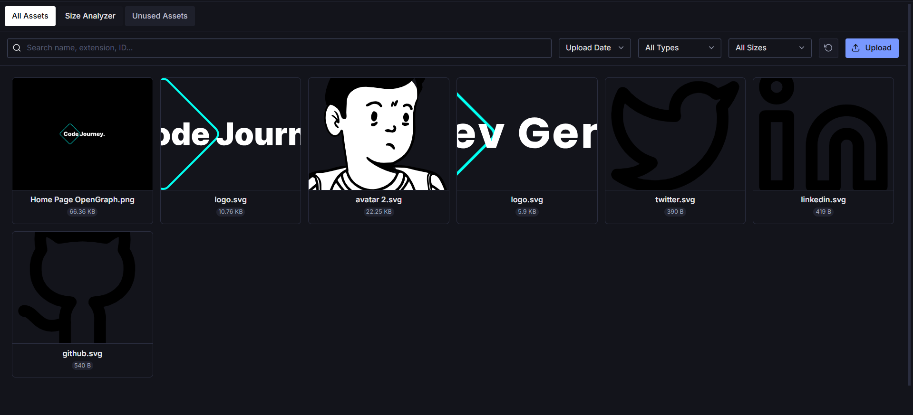
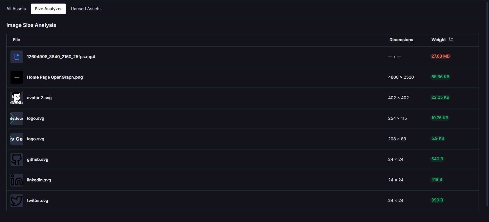
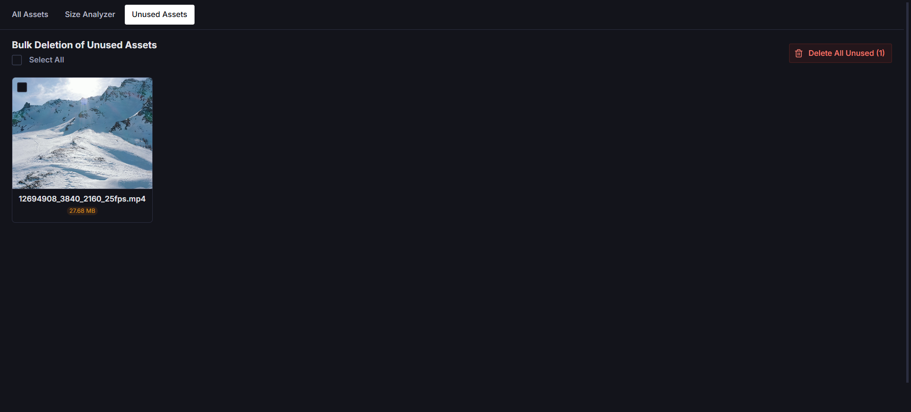
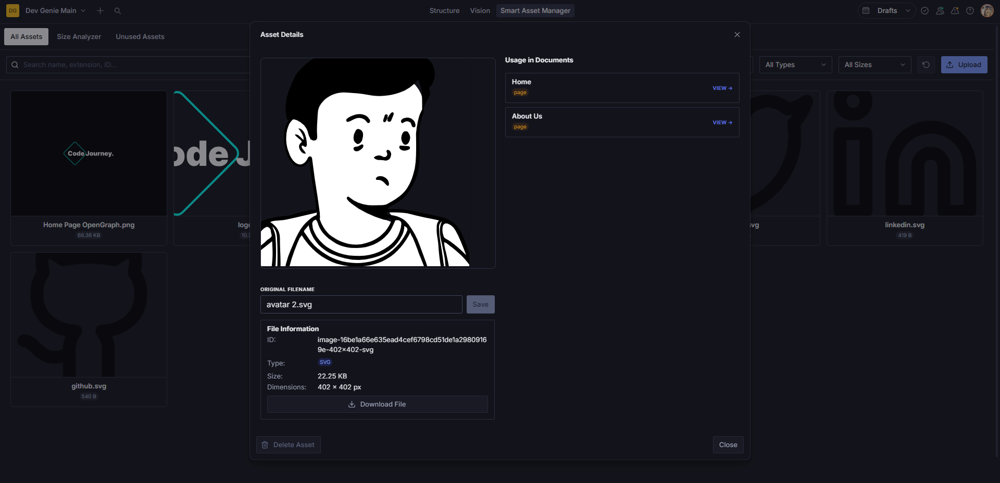

# Sanity Plugin Smart Asset Manager

[](https://www.npmjs.com/package/sanity-plugin-smart-asset-manager)
[](https://opensource.org/licenses/MIT)

An advanced, premium asset management dashboard for Sanity Studio. Stop guessing which assets are bloating your project—take full control of your media library with smart analysis, bulk cleanup tools, and deep usage tracking.

---

## ✨ Features

### 🔍 Advanced Filtering & Sorting

Easily navigate through your media library. Filter by **Images**, **Videos**, **Audio**, and other file types. Use the built-in size filters to find **Small (<100KB)**, **Medium (100KB-1MB)**, or **Large (>1MB)** files instantly.



### 📊 Image Size Analyzer

Identify performance bottlenecks. The Analyzer tab lists your assets by weight and dimensions. You can sort by file size (Weight) to quickly find unoptimized images that are slowing down your site.



### 🧹 Unused Asset Detector & Bulk Cleanup

Keep your dataset lean and save on storage costs.

- **Smart Detection**: Automatically finds assets not referenced by any document.
- **Multi-Select**: Use checkboxes to select specific assets for deletion.
- **Bulk Delete**: Delete all or selected unused assets with a single click after a safety confirmation.



### 🛡️ Duplicate Prevention

Stop uploading the same file twice. The plugin automatically checks for existing filenames during upload and warns you if a duplicate is detected, keeping your library clean and organized.

### 🔗 Deep Usage Tracking

Never delete a critical asset by mistake. Click any asset to see exactly which documents are referencing it. You can even click a document in the usage list to jump straight to the editor.



### ⚡ Batch Uploads

Upload multiple files at once. The plugin provides clear progress feedback and handles batch processing efficiently, with a smart 1-second delay after completion to ensure Sanity's backend has indexed your new files.

---

## 📦 Installation

```bash
npm install sanity-plugin-smart-asset-manager
# or
yarn add sanity-plugin-smart-asset-manager
# or
pnpm add sanity-plugin-smart-asset-manager
```

---

## 🛠 Usage

1. Add the plugin to your `sanity.config.ts` (or `.js`):

```typescript
import {defineConfig} from 'sanity'
import {smartAssetManager} from 'sanity-plugin-smart-asset-manager'

export default defineConfig({
  // ...
  plugins: [
    smartAssetManager(),
    // ...
  ],
})
```

2. Open your Sanity Studio. You will see a new **Smart Asset Manager** tool in your navigation bar.

---

## 🚀 Why This Plugin?

Sanity's default media library is great for selection, but maintenance can be challenging as libraries grow. **Smart Asset Manager** provides the power tools needed for:

- **Performance Optimization**: Find and replace heavy assets.
- **Cost Management**: Remove gigabytes of unused files.
- **Workflow Efficiency**: Batch upload and deep usage insights.

---

## 🛠️ Development & Building

To build the plugin locally:

```bash
npm run build
```

The plugin uses `tsup` for lightning-fast ESM and CJS builds with declaration types.

---

## 📄 License

[MIT](LICENSE) © [Code Journey](https://github.com/Code-Journey-77)

---
