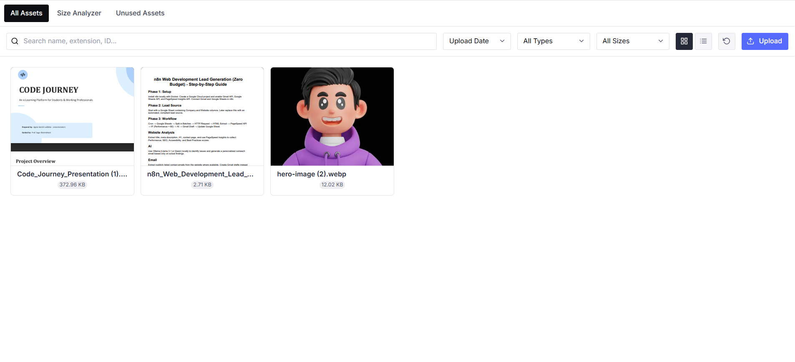
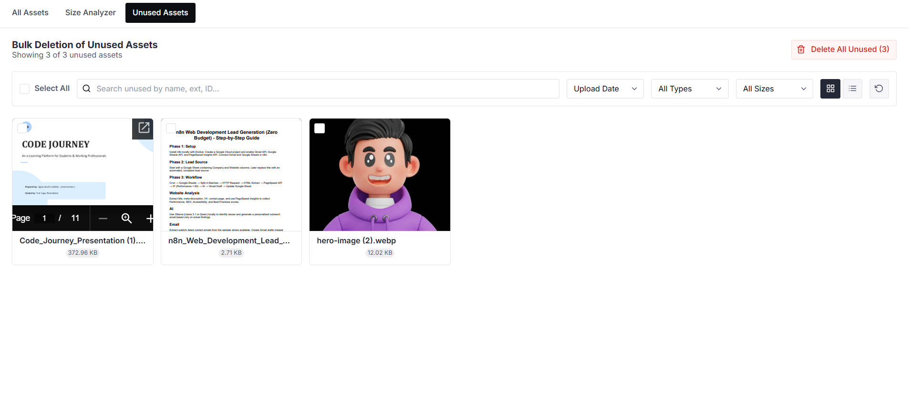
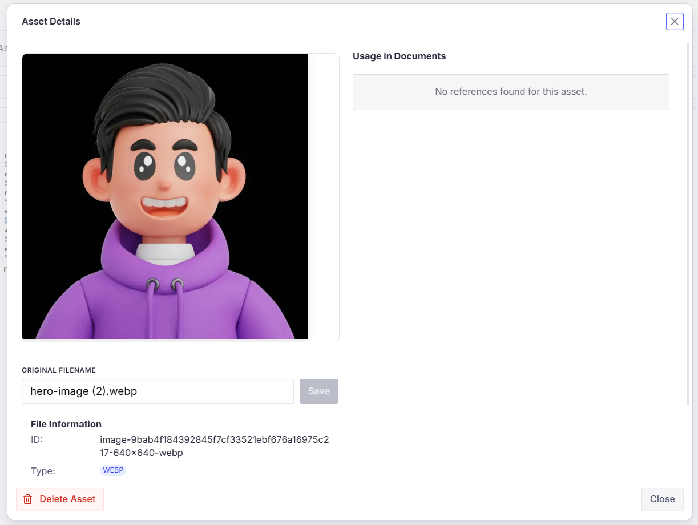

# Sanity Plugin Smart Asset Manager

[](https://www.npmjs.com/package/sanity-plugin-smart-asset-manager)
[](https://opensource.org/licenses/MIT)

An advanced, premium asset management dashboard for Sanity Studio. Stop guessing which assets are bloating your project—take full control of your media library with smart analysis, bulk cleanup tools, and deep usage tracking.

---

## Features

### Advanced Filtering & Multi-Directional Sorting

Easily navigate through your media library:

- **Comprehensive Sorting**: Sort assets by **Upload Date (Newest/Oldest)**, **Name (A-Z / Z-A)**, and **File Size (High to Low / Low to High)**.
- **Media Type Filtering**: Filter by **Images**, **Videos**, **Audio**, and **Other Files** with robust MIME and extension fallbacks.
- **Server-Side Size Filters**: Quickly locate **Small (<100KB)**, **Medium (100KB–1MB)**, or **Large (>1MB)** files with accurate dataset pagination.
- **Fast Search & Instant Reset**: Search across filenames, document IDs, and file extensions with a single-click reset button to restore default views.



### Live Document & PDF Previews

Preview PDF files, Word documents, Excel spreadsheets, PowerPoint presentations, and text files directly inside the grid and list views with seamless, scrollbar-free inline rendering.

### Skeleton Loading Screens

Enjoy smooth visual feedback with custom shimmer skeleton screens across **All Assets**, **Size Analyzer**, and **Unused Assets** tabs.

### Complete Dataset Size Analyzer

Identify storage and performance bottlenecks. The Analyzer scans your full asset library by file weight and dimensions, allowing you to sort by size to locate unoptimized media across your entire dataset.

### Unused Asset Detector & Bulk Cleanup

Keep your dataset lean and save on storage costs.

- **Smart Detection**: Automatically finds assets not referenced by any document.
- **Multi-Select**: Use checkboxes to select specific assets for deletion.
- **Bulk Delete**: Delete all or selected unused assets with a single click after a safety confirmation.



### Duplicate Prevention

Stop uploading the same file twice. The plugin automatically checks for existing filenames during upload and warns you if a duplicate is detected, keeping your library clean and organized.

### Deep Usage Tracking

Never delete a critical asset by mistake. Click any asset to see exactly which documents are referencing it. You can even click a document in the usage list to jump straight to the editor.



### Batch Uploads

Upload multiple files at once. The plugin provides clear progress feedback and handles batch processing efficiently, with a smart 1-second delay after completion to ensure Sanity's backend has indexed your new files.

---

## ⚠️ Compatibility Note

| Package                          | Version Requirement                               |
| -------------------------------- | ------------------------------------------------- |
| **Sanity Studio (`sanity`)**     | **`^5.0.0` or `^6.0.0`** _(Required for v2.0.0+)_ |
| **Sanity UI (`@sanity/ui`)**     | **`^4.0.0`**                                      |
| **React (`react`, `react-dom`)** | **`^18.0.0` or `^19.0.0`**                        |
| **Styled Components**            | **`^6.0.0`**                                      |

> **Legacy Studio Support (Sanity v3.x)**:
> If you are using **Sanity Studio v3.x** or earlier versions of `@sanity/ui` (v3/v4), please install **`sanity-plugin-smart-asset-manager@1.2.0`**:
>
> ```bash
> npm install sanity-plugin-smart-asset-manager@1.2.0
> ```

---

## Installation

```bash
npm install sanity-plugin-smart-asset-manager
# or
yarn add sanity-plugin-smart-asset-manager
# or
pnpm add sanity-plugin-smart-asset-manager
```

---

## Usage

1. Add the plugin to your `sanity.config.ts` (or `.js`):

```typescript
import {defineConfig} from 'sanity'
import {smartAssetManager} from 'sanity-plugin-smart-asset-manager'

export default defineConfig({
  // ...
  plugins: [
    smartAssetManager(),
    // ...
  ],
})
```

2. Open your Sanity Studio. You will see a new **Smart Asset Manager** tool in your navigation bar.

---

## Why This Plugin?

Sanity's default media library is great for selection, but maintenance can be challenging as libraries grow. **Smart Asset Manager** provides the power tools needed for:

- **Performance Optimization**: Find and replace heavy assets.
- **Cost Management**: Remove gigabytes of unused files.
- **Workflow Efficiency**: Batch upload and deep usage insights.

---

## ⚖️ License

MIT License © Code-Journey. All rights reserved.

Licensed under the MIT License. You may obtain a copy of the License at [LICENSE](LICENSE).

---

## ⭐ Support & Feedback

If you find this plugin helpful, intuitive, or visually stunning, please consider leaving a star on our repository! Your appreciation helps keep us motivated to design, update, and maintain premium developer tools.

- 👉 **[Star the Repository on GitHub](https://github.com/Code-Journey-77/sanity-plugin-smart-asset-manager)**
- 🔗 **[Sanity Plugin Marketplace Listing](https://www.sanity.io/plugins/sanity-plugin-smart-asset-manager)**
